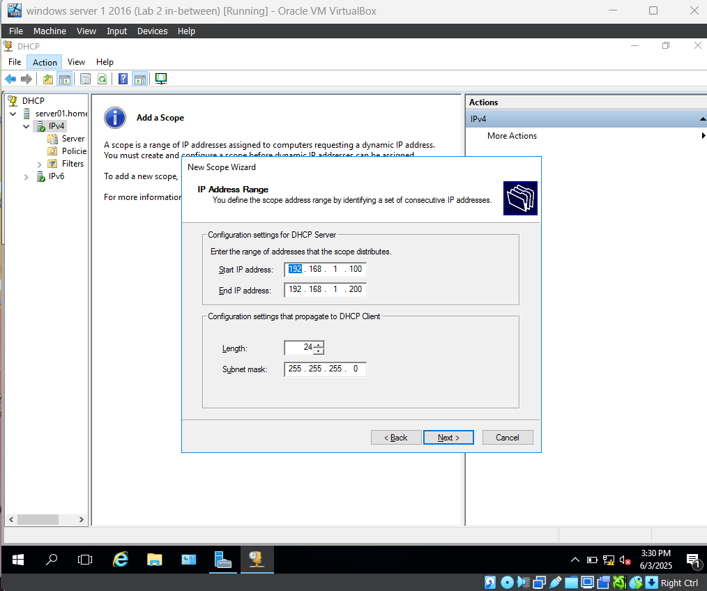
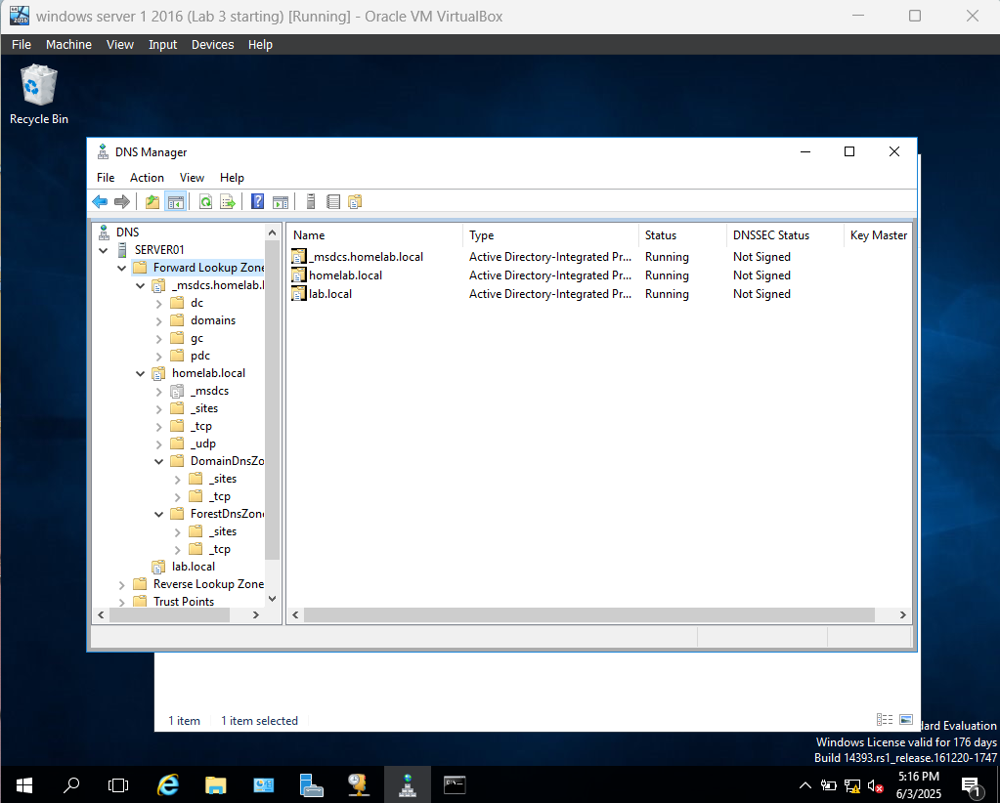
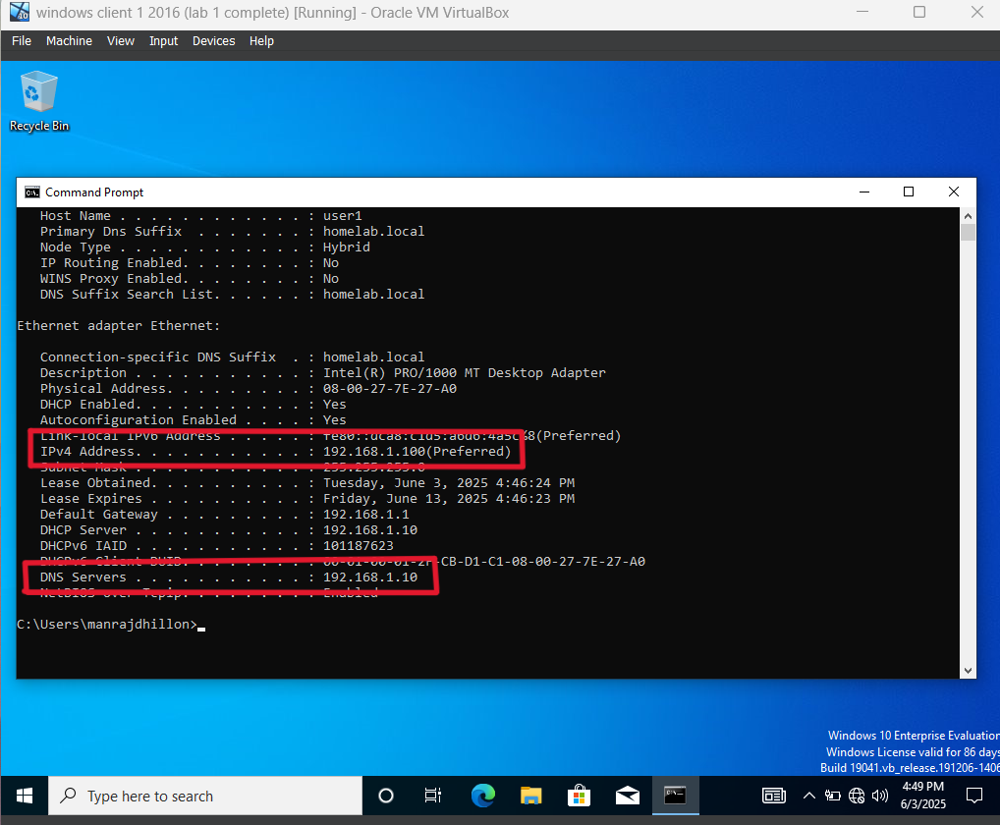
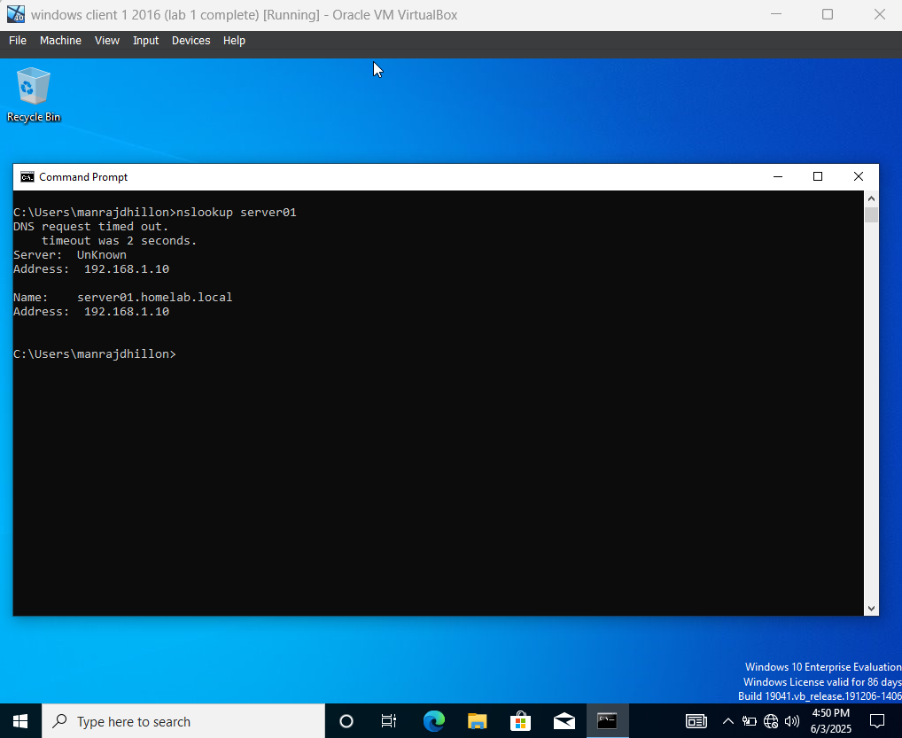

# lab3-DHCP-and-DNS-Server

## What’s this lab about?
In this lab, I set up DHCP and DNS on a Windows Server VM. The goal was to get a client VM to automatically grab an IP address and resolve hostnames without manual configuration.

This is part of my ongoing journey to hone my skills as system administrator, and every lab helps me understand how things work under the hood.

## What I did 🔧

- Installed and configured the **DHCP Server** role.
- Set up the **DNS Server** for local name resolution.
- On the client side:
  - Got an IP from DHCP automatically.
  - Successfully resolved the server’s hostname using `ping` and `nslookup`.

## Why it matters 💡

Understanding how DHCP and DNS work together is *huge* in real-world networking. If either one fails, users can lose access to the network — even if the cables are fine. This lab helped me see how important these services are and how to troubleshoot them when things go wrong.

## Screenshots 📸

Here’s a quick look at what I did:

| Step | Screenshot |
|------|------------|
| DHCP Setup on Server | |
| DNS Zone Configuration |  |
| Client receives IP |  |
| Name resolved via `nslookup` |  |

## Reflections 🧠

This lab was pretty smooth compared to the previous ones. One small hiccup was the DNS not resolving at first — turned out I forgot to set the preferred DNS server on the client to point to the server. Easy fix, but a good reminder to double-check basic settings.

## 🔗 More coming soon

I’ll be uploading more labs as I go. You can check out the rest of my projects [here](https://github.com/Manraj2901?tab=repositories).

---

Thanks for checking it out!
